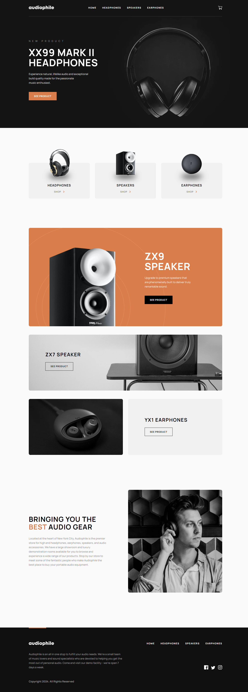

# Audiophile e-commerce

This repository showcases my solution to the [Audiophile e-commerce challenge on Frontend Mentor](https://www.frontendmentor.io/challenges/audiophile-ecommerce-website-C8cuSd_wx). Frontend Mentor challenges help you improve your coding skills by building realistic projects.

## Table of Contents

- [Overview](#overview)
  - [The Challenge](#the-challenge)
  - [Screenshot](#screenshot)
  - [Links](#links)
- [My Process](#my-process)
  - [Built With](#built-with)
  - [Server Action and Form Validation](#server-action-and-form-validation)
  - [Next.js Server Components](#nextjs-server-components)
  - [Toast Messager](#toast-messager)
  - [SASS Mixins](#sass-mixins)
- [Continued Development](#continued-development)

## Overview

### The Challenge

Users should be able to:

- View the optimal layout for the app depending on their device's screen size
- See hover states for all interactive elements on the page
- Add/Remove products from the cart
- Edit product quantities in the cart
- Fill in all fields in the checkout
- Receive form validations if fields are missed or incorrect during checkout
- See correct checkout totals depending on the products in the cart
  - Shipping always adds $50 to the order
  - VAT is calculated as 20% of the product total, excluding shipping
- See an order confirmation modal after checking out with an order summary
- **Bonus**: Keep track of what's in the cart, even after refreshing the browser (`localStorage` could be used for this if you're not building out a full-stack app)

### Screenshot

### Links

- Live Site URL: [Vercel](https://audiophile-ecommerce-rgomes98.vercel.app/)
- Solution URL: [Frontend Mentor](https://www.frontendmentor.io/solutions/audiophile-ecommerce-website-solution-Edokdmn73O)

## My Process

### Built With

- [React.js](https://reactjs.org/) - JavaScript library
- [Next.js](https://nextjs.org/) - React framework
- [Zod](https://zod.dev/) - Runtime type checking for JavaScript
- [TypeScript](https://typescriptlang.org/) - Typed superset of JavaScript
- [SASS](https://sass-lang.com/) - CSS preprocessor
- [Figma](https://figma.com/) - Collaborative design tool

### Server Action and Form Validation

I implemented a server action using Next.js to validate the form. This server action ensures that the form inputs are validated for correctness and completeness. Zod was utilized for validating the form inputs, providing a robust and type-safe validation mechanism.

### Next.js Server Components

The project makes use of Next.js Server Components, enhancing the efficiency and performance of the application.

### Toast Messager

I created a toast messager to provide users with informative and non-intrusive messages, improving the overall user experience.

### SASS Mixins

SASS mixins were employed to streamline and enhance the styling process, contributing to a more maintainable and organized codebase.

### Figma Design Implementation

I utilized Figma, to follow and implement the design files for this project. Figma played a crucial role in guiding the development process, allowing me to faithfully translate the visual aspects from the design files into the actual application.

## Continued Development

For future projects, I plan to delve deeper into:

- Exploring advanced **SASS** features for more efficient styling.
- Mastering **TypeScript** for enhanced type safety and better code organization.
- Utilizing **Server Components** for enhanced scalability and improved server-side rendering.
- Leveraging **Server Actions** for enhanced backend functionality and improved application performance.
